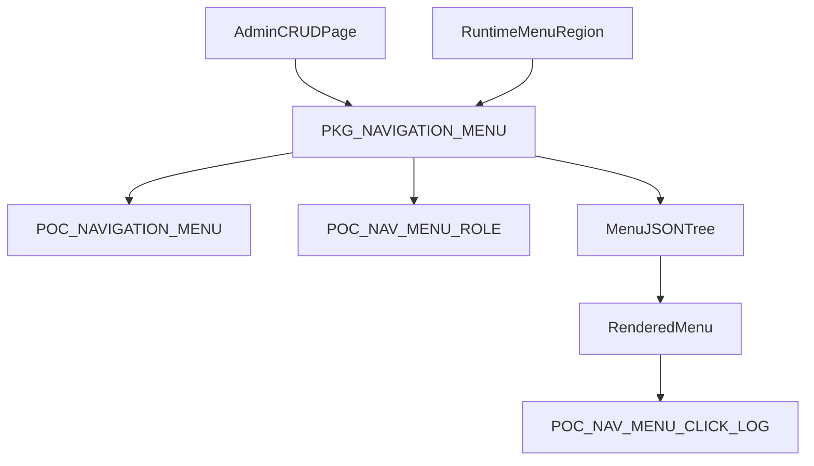

# Project 03 Dynamic Navigation Plan

## Goal

Implement `03-dynamic-navigation-menu` end-to-end in a new APEX app using package-first PL/SQL, validation-first workflows, and role-based visibility from a role mapping table.

## Baseline Inputs

- Requirements: [to_do/03-dynamic-navigation-menu/README.md](to_do/03-dynamic-navigation-menu/README.md)
- Delivery phases: [to_do/03-dynamic-navigation-menu/plan.md](to_do/03-dynamic-navigation-menu/plan.md)
- Acceptance checks: [to_do/03-dynamic-navigation-menu/checklist.md](to_do/03-dynamic-navigation-menu/checklist.md)

## Architecture (what we build)

## Implementation Plan

### Phase 1 - Data Model (Foundation)

- Create core menu table `POC_NAVIGATION_MENU` with:
  - hierarchy: `menu_id`, `parent_menu_id`
  - behavior: `target_url`, `js_action_name`, `js_action_payload`
  - presentation: `menu_label`, `icon_class`, `css_class`, `display_sequence`
  - lifecycle: `is_active`, `valid_from`, `valid_to`
  - audit: `created_at/by`, `updated_at/by`
- Create role mapping table `POC_NAV_MENU_ROLE` (`menu_id`, `role_code`, active dates).
- Create click audit table `POC_NAV_MENU_CLICK_LOG` for Phase 5 analytics.
- Add constraints and indexes for parent lookup, active-date filtering, and sequence sorting.

### Phase 2 - Package API (Business Logic Layer)

- Create package `PKG_NAVIGATION_MENU` with public API:
  - `create_menu_entry`, `update_menu_entry`, `delete_menu_entry`
  - `validate_hierarchy` (cycle prevention)
  - `validate_target` (URL pattern policy)
  - `get_menu_tree_json(p_username in varchar2)`
  - `log_menu_click(...)`
- Keep APEX processes thin: all business rules in package only.
- Add robust exception handling with backtrace logging.

### Phase 3 - Admin Management UI (New APEX app)

- Create new app for Project 03 with:
  - Admin page (Interactive Grid or Form + Tree) for CRUD on menu entries
  - Role assignment region for `POC_NAV_MENU_ROLE`
  - Preview region showing resolved menu tree from package output
- Add server-side validations:
  - parent-child loops blocked
  - invalid target URLs rejected
  - sequence and active-window rules enforced

### Phase 4 - Runtime Rendering + JS Actions

- Build runtime menu region using package JSON/tree output.
- Render icon and CSS class safely (allowlist patterns, no arbitrary HTML).
- Implement JS action contract:
  - allow function names only from allowlist
  - pass payload as JSON object
  - graceful fallback when handler missing

### Phase 5 - Security and Access

- Filter menu entries in package query by role mappings for current user.
- Hide unauthorized/inactive/out-of-window entries at query time.
- Log clicks for audit and UX analytics (`POC_NAV_MENU_CLICK_LOG`).

### Phase 6 - Verification and Hardening

- Execute all items in [to_do/03-dynamic-navigation-menu/checklist.md](to_do/03-dynamic-navigation-menu/checklist.md).
- Add seed data for representative scenarios:
  - nested menu
  - inactive entries
  - unauthorized entries
  - JS action + missing handler case
- Run regression smoke tests on add/update/remove menu entries without redeploy.

## Senior-Developer Learning Track (how I will teach as we build)

- For each phase I will explain three things explicitly: **what to do, where to do it, why this design scales**.
- Every implementation step includes:
  - security rationale (bind variables, validation boundaries)
  - maintainability rationale (package API, explicit contracts)
  - operability rationale (audit logs, deterministic errors)
- We will treat each checklist item as a mini code review gate before moving on.

## Deliverable Layout (proposed)

- [to_do/03-dynamic-navigation-menu/resolution/01_data_model.sql](to_do/03-dynamic-navigation-menu/resolution/01_data_model.sql)
- [to_do/03-dynamic-navigation-menu/resolution/02_pkg_navigation_menu.pks](to_do/03-dynamic-navigation-menu/resolution/02_pkg_navigation_menu.pks)
- [to_do/03-dynamic-navigation-menu/resolution/03_pkg_navigation_menu.pkb](to_do/03-dynamic-navigation-menu/resolution/03_pkg_navigation_menu.pkb)
- [to_do/03-dynamic-navigation-menu/resolution/04_seed_and_test.sql](to_do/03-dynamic-navigation-menu/resolution/04_seed_and_test.sql)
- [to_do/03-dynamic-navigation-menu/resolution/05_apex_build_notes.md](to_do/03-dynamic-navigation-menu/resolution/05_apex_build_notes.md)

## Execution Order

1. Finalize data model DDL and constraints
2. Implement and unit-test package validations
3. Build admin UI and hook package APIs
4. Build runtime renderer + JS guardrails
5. Enable role filtering + click audit
6. Run full checklist and fix gaps

